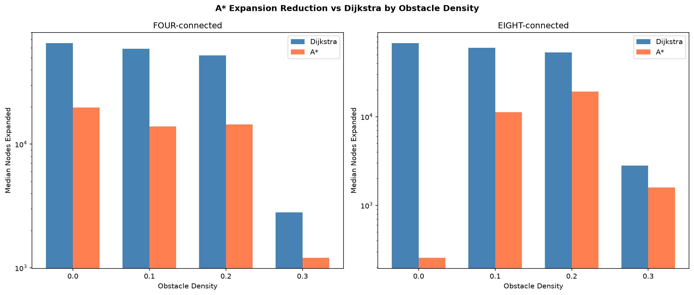
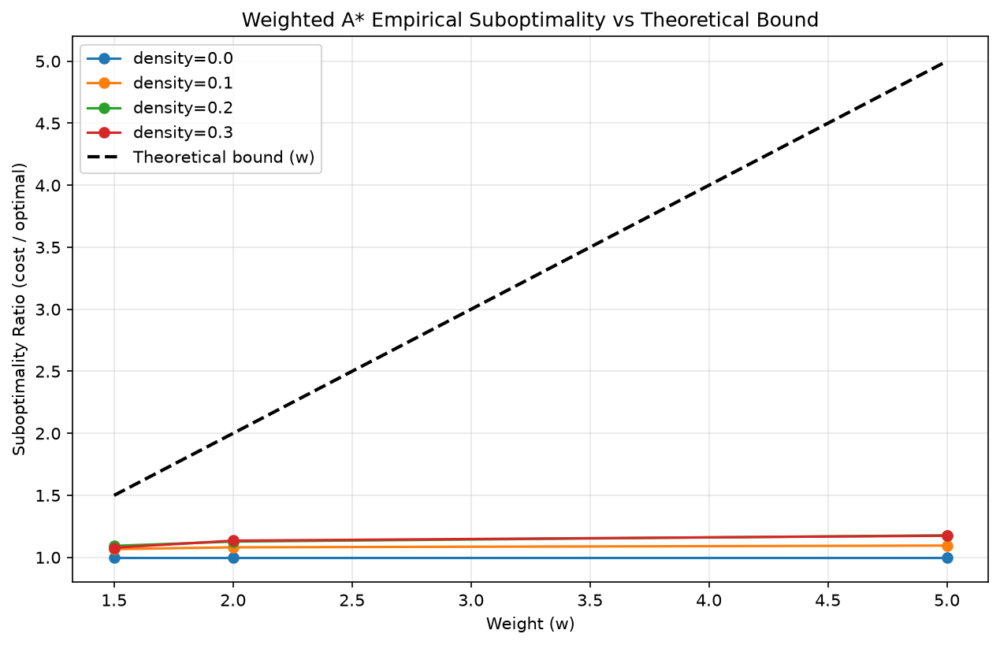
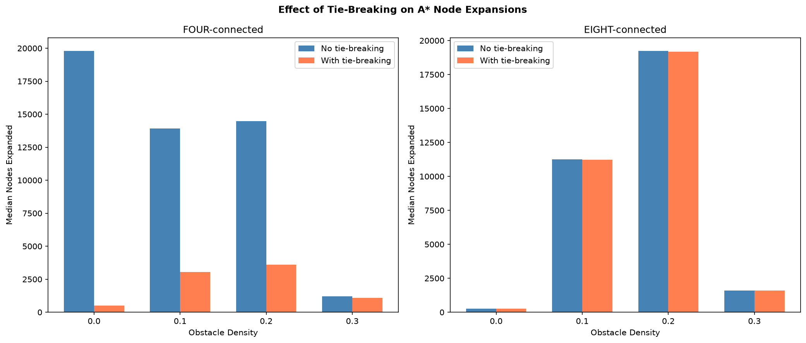
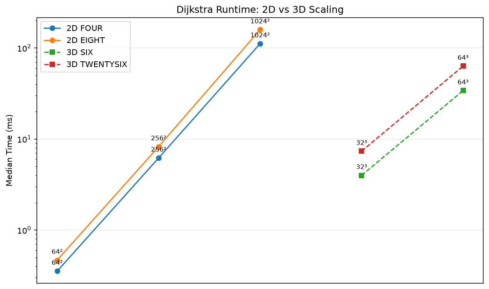
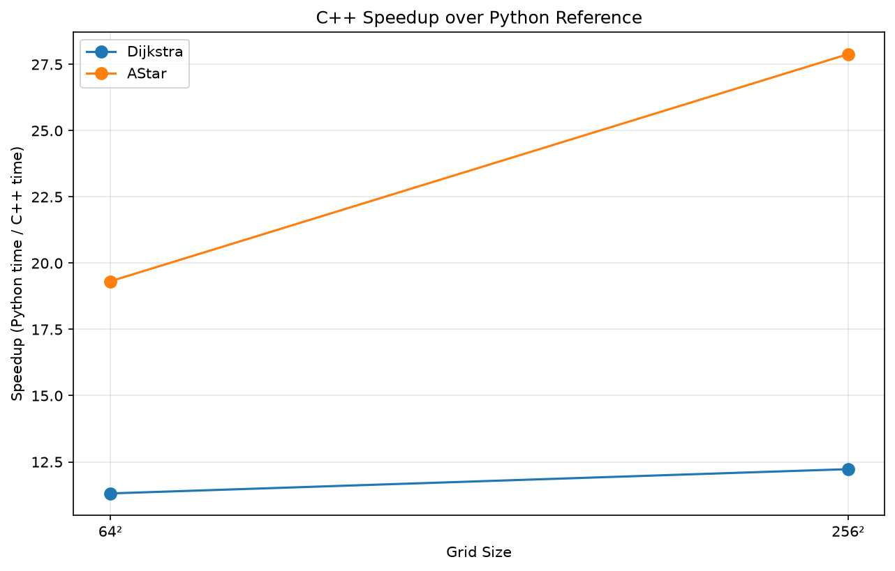
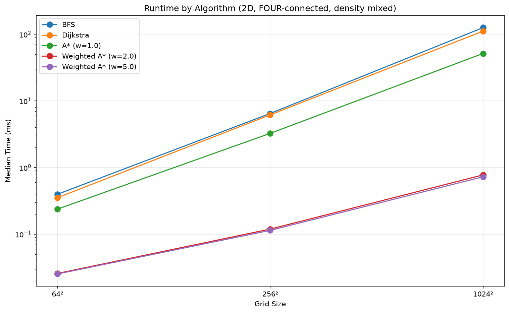
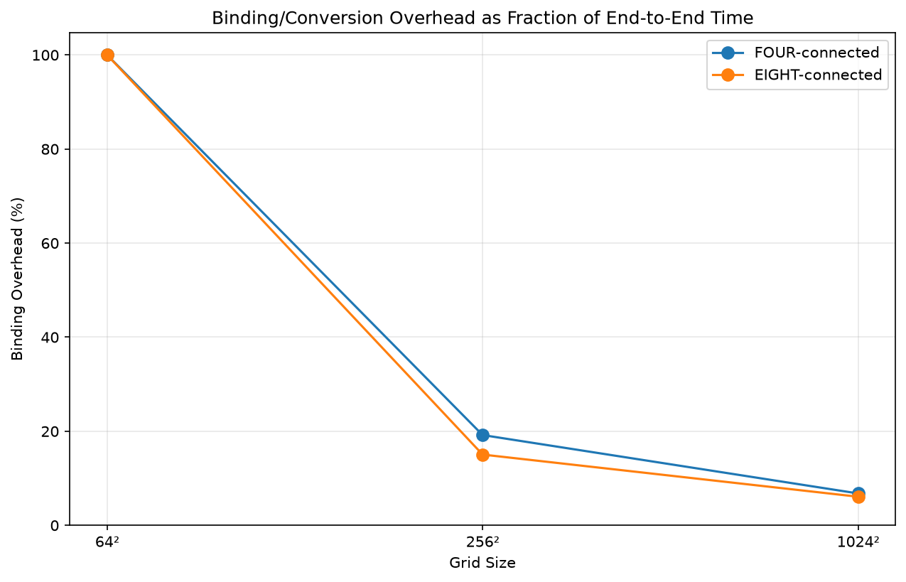
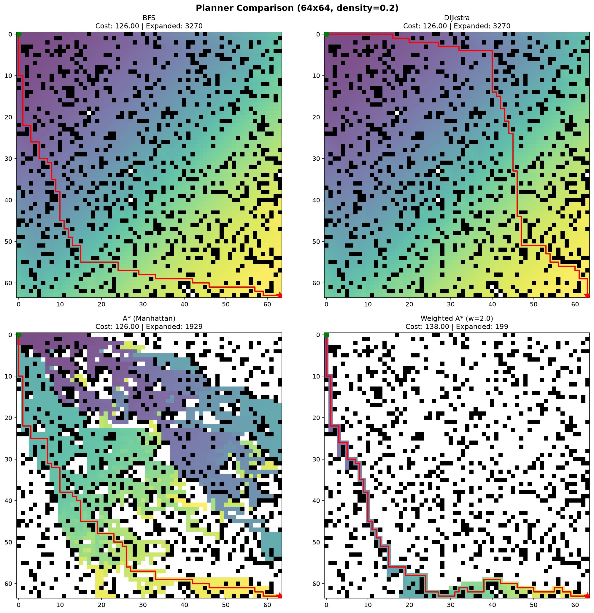
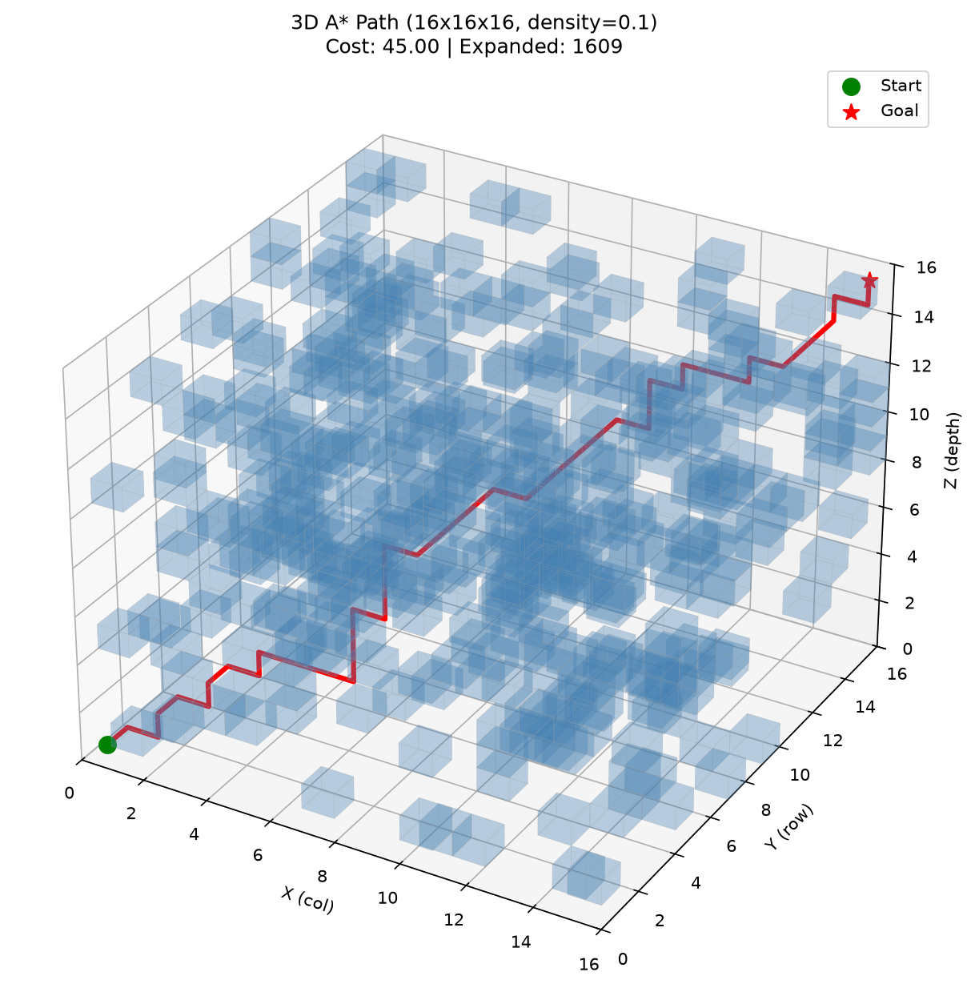

# Gridplan: Graph-Search Planner Benchmark

A hybrid C++20/Python library implementing BFS, Dijkstra, A*, and weighted A* on 2D and 3D occupancy grids. Part of a drone autonomy project track — this library provides the foundation for trajectory generation and incremental replanning.

## Build & Install

```bash
cd gridplan
pip install -e .
```

Run C++ tests:
```bash
cmake --preset debug
cmake --build build/debug
ctest --test-dir build/debug
```

Run Python tests:
```bash
pytest tests/ -v
```

Run benchmarks:
```bash
cmake --preset release
cmake --build build/release --target bench_planners
./build/release/bench_planners
```

Run the benchmark sweep and analysis:
```bash
python benchmarks/run_benchmark.py --seeds 5
python benchmarks/analyze.py
```

## Architecture

- **C++ core (`gridplan_core`)** — flat-array grid with padded borders, precomputed neighbor offset/cost tables, BFS, Dijkstra, A*, weighted A* with configurable heuristics and tie-breaking
- **pybind11 bindings** — expose all planners to Python, accepting NumPy arrays, releasing the GIL during search
- **Python layer** — environment generation, pure-Python reference planners (correctness oracle), visualization, benchmarking

### Design Decisions

- **Flat `std::vector<uint8_t>` with padded borders** — eliminates bounds checks in the inner loop. Neighbors are computed by adding precomputed offsets to linear indices.
- **Runtime-parameterized dimensions** (not templated on 2D/3D) — simpler code, one Grid class handles both. The cost is a branch on `depth_` in `index_to_coords`, which is negligible.
- **Lazy-deletion priority queue** for Dijkstra; **closed set** for A* — A* uses a closed set because the stale-check approach is incompatible with f-values that include a heuristic.
- **Corner-cutting constraints** stored in the neighbor table — each diagonal entry carries the component offsets that must be free, checked at neighbor-generation time.

## Results

### A* Expansion Reduction vs Dijkstra



- A* consistently expands fewer nodes than Dijkstra across all densities and connectivity modes
- On 8-connected grids with the octile heuristic, A* expands orders of magnitude fewer nodes (e.g., ~200 vs ~50,000 on open grids)
- The advantage narrows on cluttered grids (density=0.3) because obstacles force detours that the heuristic can't predict — the search must explore more of the reachable space
- On 4-connected grids the gap is smaller because Manhattan distance is a looser heuristic relative to octile

### Weighted A* Suboptimality



- Empirical suboptimality stays well below the theoretical bound of `w`
- At w=5.0, actual suboptimality is only ~1.1-1.15x optimal — far below the guaranteed 5x bound
- On open grids (density=0.0), weighted A* finds the optimal path regardless of weight because the heuristic guides it directly to the goal
- Higher density increases suboptimality slightly because the weighted heuristic sometimes commits to suboptimal corridors

### Tie-Breaking Effect



- Tie-breaking (prefer larger g on equal f) has a massive effect on open 4-connected grids: ~20,000 expansions without tie-breaking vs ~500 with it
- On open grids, many nodes share the same f-value. Without tie-breaking, A* explores them all. With tie-breaking, it prefers nodes closer to the goal
- On cluttered grids (density=0.3), the effect diminishes because obstacles create fewer ties — most nodes have distinct f-values
- On 8-connected grids with octile heuristic, the effect is less pronounced because the heuristic already produces fewer ties

### 2D vs 3D Runtime Scaling



- Runtime scales with the number of cells: 64³ (~260k cells) takes comparable time to 1024² (~1M cells) despite having fewer cells per axis
- 3D 26-connected is slower than 3D 6-connected due to 26 neighbors per cell vs 6
- This cubic scaling explains why onboard drone planners use sparser representations (octrees, probabilistic roadmaps) rather than dense voxel grids for large outdoor volumes

### C++ vs Python Speedup



- C++ is 11-28x faster than the Python reference implementation
- A* shows higher speedup (~19-28x) than Dijkstra (~11-12x) — the Python overhead per expansion is more impactful when there are fewer expansions
- Speedup increases slightly with grid size as binding/conversion overhead becomes a smaller fraction of total time

### Runtime by Algorithm



- BFS and Dijkstra have similar runtime on 4-connected grids (uniform costs)
- A* (w=1.0) is ~2-3x faster than Dijkstra due to fewer expansions
- Weighted A* (w=2.0 and w=5.0) is ~100x faster than BFS/Dijkstra on 1024² grids — the heuristic aggressively prunes the search space
- All algorithms scale roughly linearly with the number of cells they expand

### Binding Overhead



- Binding/conversion overhead is the fraction of end-to-end Python time spent outside the C++ search
- On small grids (64²), overhead can be significant because the search itself is sub-millisecond
- On larger grids (1024²), overhead becomes negligible (<5%) — the search dominates total time
- This confirms that the pybind11 interface adds minimal cost for realistic problem sizes

## Visualization

### 2D Planner Comparison



Generate with:
```python
from gridplan.envgen import Environment
from gridplan.viz2d import plot_comparison, generate_all_animations

env = Environment((64, 64), 0.2, seed=42)
plot_comparison(env, save_path="comparison.png")
generate_all_animations(env)
```

### 3D Path Rendering



Generate with:
```python
from gridplan.viz3d import plan_and_render_3d
plan_and_render_3d(shape=(16, 16, 16), density=0.1, seed=42, save_path="viz3d_path.png")
```

## Path Geometry

- Paths on 4-connected grids exhibit staircase patterns with many unnecessary 90-degree heading changes
- 8-connected grids produce smoother paths but still snap to 45-degree increments
- Weighted A* paths tend to be more direct but may take suboptimal corridors
- These geometric artifacts motivate the trajectory smoothing in Project 3 (trajectory generation)

## References

- Hart, Nilsson, and Raphael (1968), *A Formal Basis for the Heuristic Determination of Minimum Cost Paths*
- LaValle, *Planning Algorithms* (Cambridge University Press, 2006), Chapter 2
- Amit Patel, *Red Blob Games* — A* and grid heuristics
- Nash, Daniel, Koenig, and Felner (2007), *Theta*: Any-Angle Path Planning on Grids*
